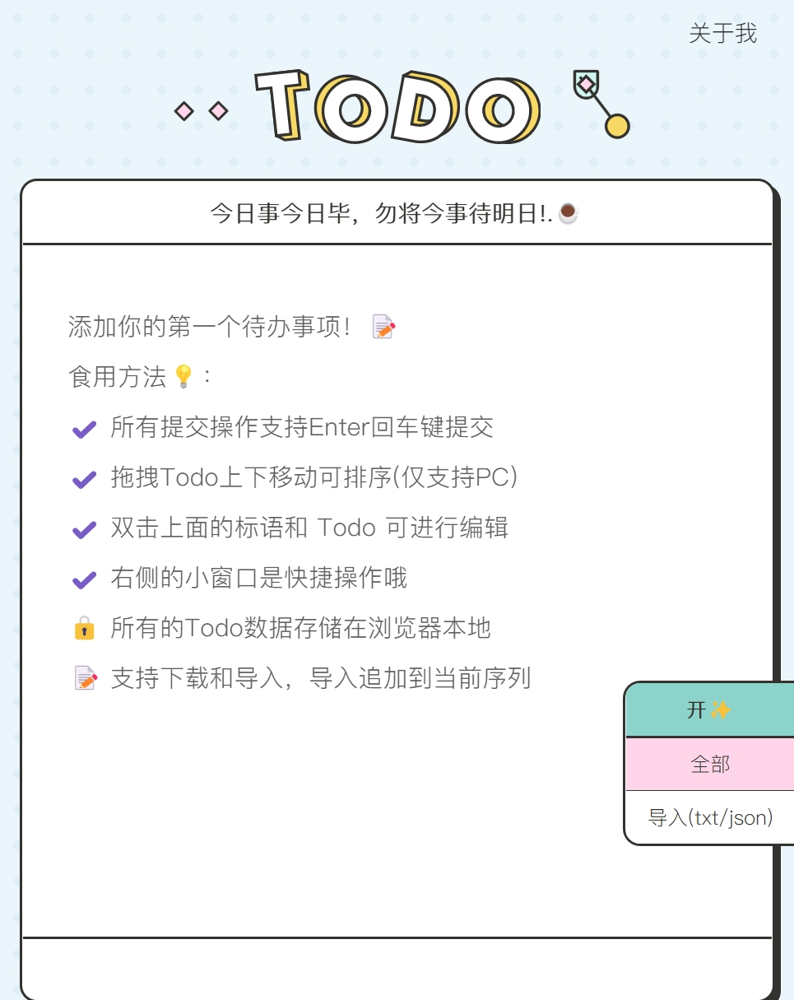
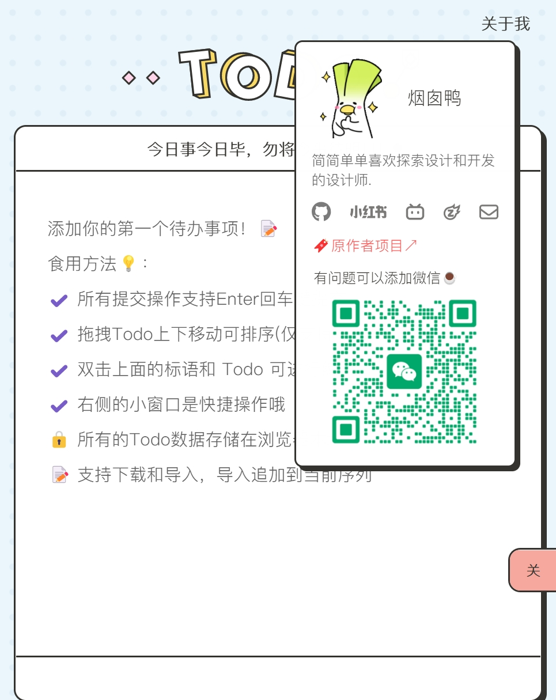
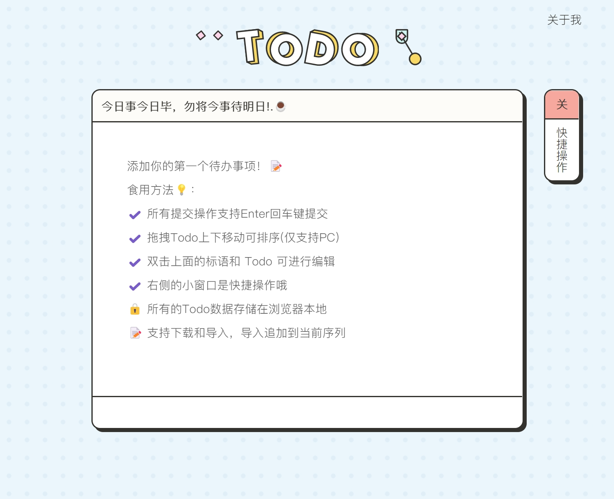
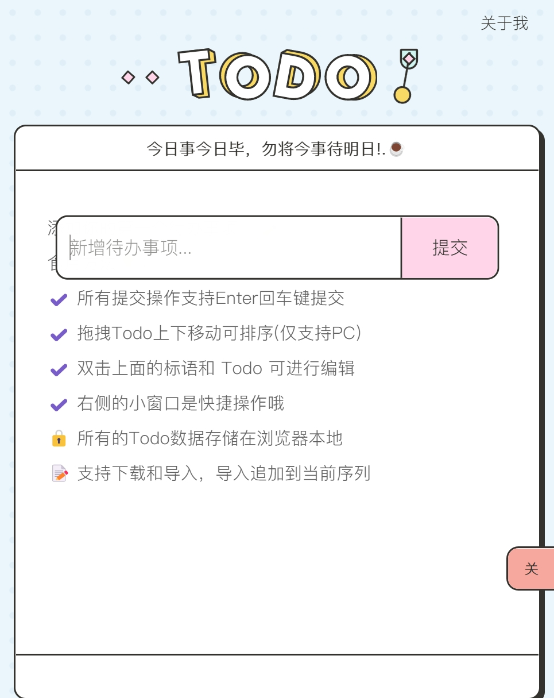
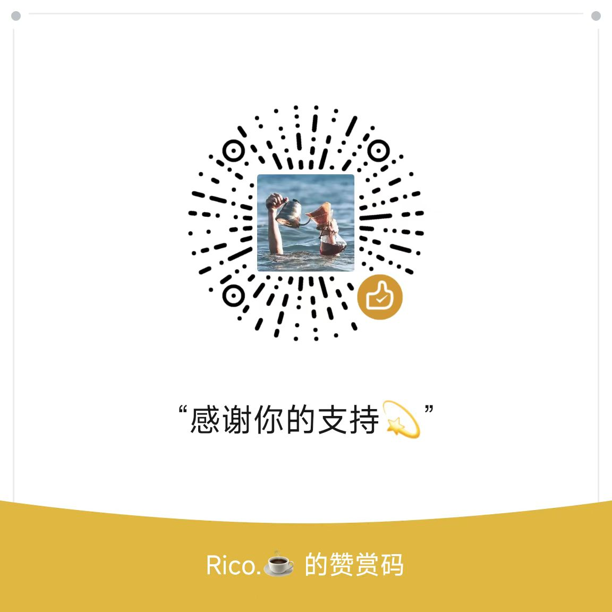

# Uiineed Todo List 介绍

[📍 English Intro Click Here](#intro)




***静态文件，本地下载打开即可使用，默认是 index.html英文，index-zh.html 为中文。***

中文版线上地址： <a href="https://ricocc.com/todo/" target="_blank">Ricocc Todo 待办清单 </a>
 
在工作时使用 Todo List 是非常常见的,市面上的 Todo List 类产品非常多,无论是电脑端的应用还是手机端的 APP、小程序等,而且也考虑用户的多样化需求,开发了各种功能,还有一些社交属性,有些还免不了广告的存在。

我个人的产品诉求是:基础、干净简洁、不需要额外功能、视觉合格。

所以不如尝试自己写一个 Todo List 应用,既可以满足自己每天不同的想法和需求,也可以自己决定视觉风格,无论多么奇葩,只要自己喜欢就行。

在设计上,我参考了 Figma 社区 aakarshna 的 Noted 设计规范,并根据自己的设计做了调整。在前端上使用了 Vue 2.x 和 Sass,尽量使用 base64 减少文件数量。


## 使用说明

在使用上为了尽量简洁，我使用了 CDN 的形式引入Vue，不需要安装，下载完直接打开 `html` 文件即可使用。

自己上线的话，页面中也可以自定义显示个人的信息，为了体验不造成干扰，我默认注释掉了，如果需要的话，取消注释，修改为自己的信息即可。

个人信息部分如下：

```html
<!-- Custom Info -->
    <div class="nav">
        <!-- Github 仓库地址 -->
        <!-- <div class="github">
            <a href="https://github.com/ricocc/uiineed-todo-list?ref=opensource-todo" target="_blank" class="social-link">
                
            </a>
        </div> -->
        <!-- <div class="about">
            ...自定义个人信息，为了不影响体验，默认隐藏
            ...想显示，可以取消注释
        </div> -->

        <!-- 切换中英文页面，可以设置中文为主页 -->
        <div class="language switch-language">
            <a href="javascript:void(0)" class="en active">En</a>
            <span>/</span>
            <a href="index-zh.html" target="_self" class="zh">中</a>
        </div>
    </div>
```

#### 食用方法 💡
- ✔️ 所有提交操作支持Enter回车键提交
- ✔️ 拖拽Todo上下移动可排序(仅支持PC)
- ✔️ 双击上面的标语和 Todo 可进行编辑
- ✔️ 右侧的小窗口是快捷操作哦
- 🔒 所有的Todo数据存储在浏览器本地
- 📝 支持下载和导入，导入追加到当前序列

## 作者

- 小红书关注更新：<a href="https://www.xiaohongshu.com/user/profile/5f2b6903000000000101f51f" target="_blank">@Rico的设计漫想</a>
- Rico's 博客 <a href="https://blog.ricocc.com/" target="_blank">@Ricocc</a>
- X - <a href="https://x.com/ricouii" target="_blank">@Ricouii</a>

## 推荐项目
- <a href="https://github.com/ricocc/public-portfolio-site/" target="_blank">⭐Star Github- Ricocc 开源博客 </a>
- <a href="https://inspoweb.com/" target="_blank">💻 网页灵感站</a>
- <a href="https://og.uiineed.com/" target="_blank">🖼 免费 OG Image 生成器</a>
- <a href="https://www.aiwnt.com.cn/toolset" target="_blank">🛠️ 实用AI工具</a>
- <a href="https://gradientshub.com/" target="_blank">🎨渐变背景和生成工具</a>

---
<br/>
<div id="intro"></div>


# Introducing Uiineed Todo List




Using a Todo List is very common in work. There are many Todo List products on the market, whether they are desktop applications or mobile apps/mini-programs. These products often consider diverse user needs, developing various features, including some social attributes, and even inevitably containing advertisements.

My personal product requirements are: basic, clean and simple, no need for extra features, and visually satisfactory.

So I decided to try writing my own Todo List application, which can not only meet my different daily ideas and needs, but also allow me to decide the visual style, no matter how quirky, as long as I like it.

In the design, I referenced the Noted design specification from the Figma community by aakarshna, and made adjustments based on my own design. On the front-end, I used Vue 2.x and Sass, and tried to use base64 to reduce the number of files.


## Usage

To keep things as simple as possible, I used a CDN to import Vue, so there's no need to install anything - just download and open the html file to use it.

If you host it yourself, you can also customize the personal information displayed on the page. To avoid interference with the experience, I've commented this out by default. If you need it, just uncomment and modify the information to your own.

The personal information section is as follows:

```html
<!-- Custom Info -->
    <div class="nav">
        <!-- Github Address -->
        <!-- <div class="github">
            <a href="https://github.com/ricocc/uiineed-todo-list?ref=opensource-todo" target="_blank" class="social-link">
                
            </a>
        </div> -->
        <!-- <div class="about">
                ...Customized personal information, hidden by default to avoid affecting the experience
                ...If you want to display it, you can uncomment the code
        </div> -->

        <!-- Switch between Chinese and English pages -->
        <div class="language switch-language">
            <a href="javascript:void(0)" class="en active">En</a>
            <span>/</span>
            <a href="index-zh.html" target="_self" class="zh">中</a>
        </div>
    </div>
```
#### Usage Tips 💡
- ✔️ Press Enter to submit all actions
- ✔️ Drag to reorder your to-dos (PC only)
- ✔️ Double-click to edit slogan and tasks
- ✔️ Access quick actions in the right sidebar
- 🔒 Your data is stored locally in your browser
- 📝 Supports data download and import (appends to current list)

## Authors
- Rico's Blog <a href="https://blog.ricocc.com/" target="_blank">@Ricocc</a>
- 小红书：  <a href="https://www.xiaohongshu.com/user/profile/5f2b6903000000000101f51f" target="_blank">@Rico的设计漫想</a>
- X - <a href="https://x.com/ricouii" target="_blank">@Ricouii</a>

## Recommend
- <a href="https://github.com/ricocc/public-portfolio-site/" target="_blank">⭐Star Github- Ricocc's Blog </a>
- <a href="https://webinspo.uiineed.com/" target="_blank">💻 Web Design Inspiration</a>
- <a href="https://og.uiineed.com/" target="_blank">🖼 Free OG Image Generator</a>
- <a href="https://www.aiwnt.com/" target="_blank">🛠️ AI Web Novel Translator</a>
- <a href="https://gradientshub.com/" target="_blank">🎨Free Gradients Toolkits</a>


---


### 💜支持作者

如果觉得有所帮助的话，一点点支持就可以大大激励创作者的热情，感谢！




## License

This project is licensed under the MIT license. See the [LICENSE](./LICENSE) file for more info.
